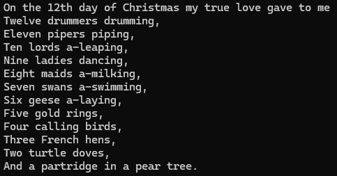

# Purpose
To use a little bit of everything in Chapters 1, 2, and 3 (minus input).
Prints out the lyrics of Twelve Days of Christmas using functions and indexing to manage the repetition of the song.

